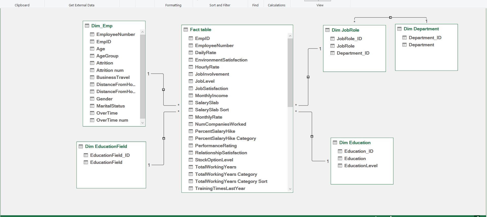
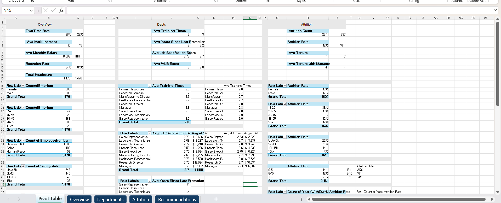
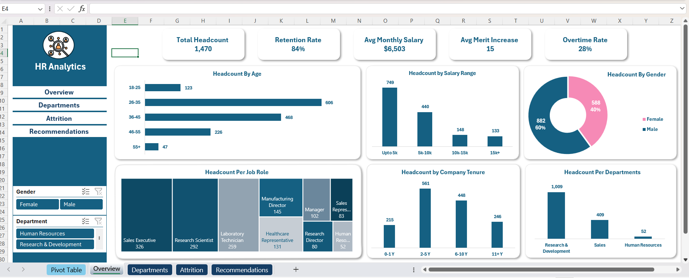
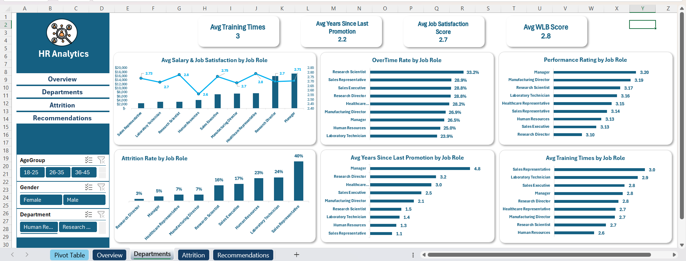
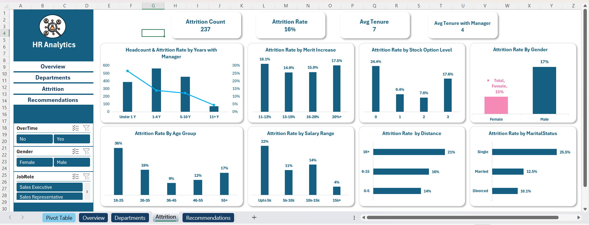
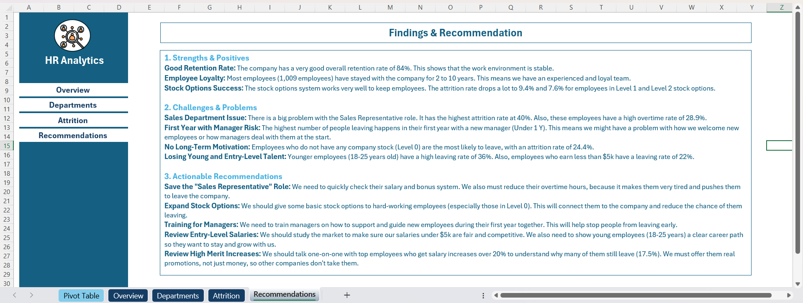

# HR Analytics Dashboard

## Project Overview

This project analyzes HR data for a company with 1,470 employees to identify the main factors affecting employee attrition and retention.

The goal was to explore the data, discover key patterns, and provide actionable recommendations that can help improve employee retention and reduce turnover.

---

## Business Problem

Employee turnover can be costly for organizations. Understanding why employees leave is important for improving retention and workforce stability.

This project focuses on answering questions such as:

- Which employee groups have the highest attrition rate?
- Does salary affect employee retention?
- How does overtime impact attrition?
- Do stock options help retain employees?
- Which job roles are most affected by turnover?

---

## Dataset Information

The dataset contains 1,470 employee records and 38 columns covering:

- Employee demographics
- Education
- Job roles
- Salary information
- Performance indicators
- Satisfaction metrics
- Career history

### Dataset Limitation

One challenge in this dataset is that it does not contain any date columns.

Because of this, the analysis is based on a single snapshot of employee data and does not include trend analysis or time-series analysis.

---

## Data Cleaning & Preparation

The data was cleaned and prepared using Excel and Power Query.

### Steps Performed

- Removed duplicate records from the dataset.
- Identified and reviewed 3 employee records with inconsistent values in the `YearsWithCurrManager` column.
- Cross-checked these records using `YearsSinceLastPromotion` to select the most logical value.
- Removed columns with constant values:
  - Over18
  - EmployeeCount
  - StandardHours
- Created categories like:
  - Salary Ranges
  - Years at Company Groups

These transformations improved data quality and made segmentation easier.

---

## Data Modeling

A Snowflake Schema was implemented to improve model organization and performance.

### Tables

#### Fact Table
- Employee Fact Table

#### Dimension Tables
- Dim Employee
- Dim Education
- Dim Education Field
- Dim Job Role
- Dim Department

### Data Model

---

### Pivot Tables

---

## Dashboard KPIs

- Total Headcount: 1,470
- Retention Rate: 84%
- Average Monthly Salary: $6,503
- Average Merit Increase: 15%
- Overtime Rate: 28%

### Dashboard

---

## Key Insights

### Positive Findings

- The company has a strong retention rate of 84%.
- Most employees have stayed between 2 and 10 years.
- Employees with Stock Option Levels 1 and 2 show significantly lower attrition rates.

### Challenges

- Sales Representatives have the highest attrition rate (40%).
- Employees with high overtime show higher turnover risk.
- Employees with less than one year under their current manager are more likely to leave.
- Employees without stock options have the highest attrition rate (24.4%).
- Employees aged 18–25 have the highest attrition rate (36%).
- Employees earning less than $5,000 show higher turnover rates.

---

## Recommendations

- Review compensation and incentive plans for Sales Representatives.
- Reduce excessive overtime where possible.
- Expand stock option programs for high-performing employees.
- Improve onboarding and manager support for new hires.
- Review salary competitiveness for lower salary bands.
- Create clearer career development paths for younger employees.
- Conduct stay interviews with high performers to better understand retention risks.

---

## Tools Used

- Excel
- Power Query
- Pivot Table
- DAX
